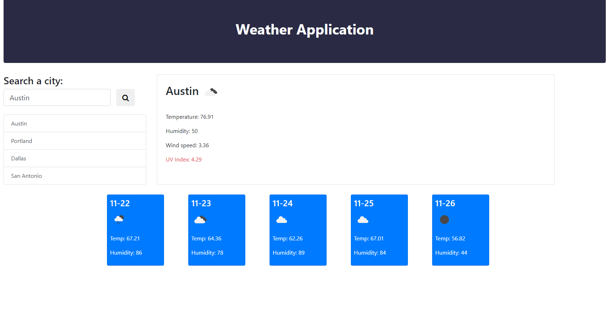

# Weather Dashboard

## Table of Contents
The following readme contains these sections:

* [Screenshot](#Screenshot)
* [Usage](#Usage)
* [Live-Link](#Live-Link)
* [License](#License)

## Screenshot

## Usage

[This Weather Dashboard](https://joey-sisk.github.io/WeatherDashboard/) will accept a users input to determine a location and display local weather information. The displayed information is for the current day as well as the next five days. Whenever you seach a city it is saved to the local memory and can be accessed by clicking on one of the buttons under the search bar. The UV index will change color to indicate the level of UV warning for that day. This weather app was build using JavaScript, HTML, CSS, jQuery, Bootstrap, and integrates the [Open Weather API](https://openweathermap.org/). 

This would not have been possible without the help of my tutor Kumar Ramanathan, my instructor Calvin Carter, all of the class TA's, and many of my fellow UT Bootcamp students.

## Live-Link

[You can find a link to the live site here.](https://joey-sisk.github.io/WeatherDashboard/)

## License

There is not currently a license for this service as it is only a homework assignment for the UT Coding Bootcamp Class 2020-2021
